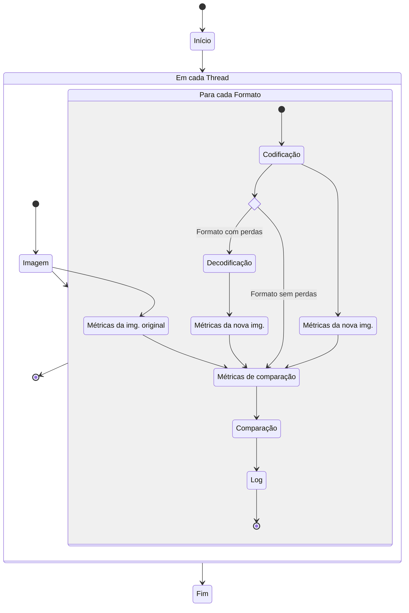

UFABC 2025 Q2 - Projeto Dirigido

# Análise (comparativa e qualitativa) de métodos de codificação de imagens

| .              | **Nome**             |
| :------------- | :------------------- |
| **Aluno**      | Guilherme AC Zaluchi |
| **Orientador** | Carlos S Santos      |

## Resumo

<!--
Comentários:

-->

Este estudo propõe uma metodologia sistemática para avaliação de técnicas de compressão de imagens em diferentes contextos de aplicação. Com o crescimento anual de 6-8% no volume de imagens digitais e o surgimento constante de novos algoritmos, torna-se essencial desenvolver ferramentas robustas para comparação objetiva entre formatos heterogêneos.

A pesquisa adotou uma abordagem metodológica dividida em quatro etapas principais: (1) seleção criteriosa de conjuntos de dados representativos (Open Images Dataset, Cards Image Dataset e Brain Tumor MRI Dataset); (2) escolha de algoritmos de codificação (JPEG, PNG, QOI, WebP) e métricas de avaliação (como SSIM e hashes perceptuais); (3) implementação de pipeline computacional em Rust e Python; e (4) análise multivariada dos resultados.

Como principal contribuição, o estudo propõe um framework de avaliação baseado em programação linear que considera tanto métricas de qualidade visual quanto parâmetros operacionais, permitindo a seleção objetiva do método mais adequado para cada contexto de aplicação.

<!-- ## Abstract -->

<!--
Comentários:

-->

## Introdução

<!--
Comentários:
-->
O problema de codificação de imagens se origina na necessidade de representar, de forma eficiente, informações visuais oriundas de diversas fontes - como fotografia convencional, composições gráficas e análises espectrais. No contexto atual, em que se tornam viáveis imagens com resoluções cada vez maiores, e também o surgimento de novas imagens se mantém em crescente (taxas anuais de 6% à 8%, no aumento do número de fotografias realizadas[^photutorial_photo_statistics]), a busca por melhores técnicas de compressão, que equilibrem fidelidade à imagem original e eficiência de armazenamento, é um campo dinâmico e ativo.

Atualmente, o campo da compressão de imagens de origem genérica é majoritariamente dominado por formatos como JPEG, PNG e WebP, cada um empregando conjuntos de estratégias distintas: transformadas espaciais (DCT no JPEG, Walsh-Hadamard no WebP)[^webp], divisão em blocos, e combinações de abordagens híbridas (PNG, WebP)[^webp], todas se aproveitando de relações espaciais, locais ou globais, da composição da imagem, a fim de reduzir a dimensionalidade necessária para representá-la, assim reduzindo o uso de banda (de disco ou de rede).
E como um campo em desenvolvimento ativo, em que algoritmos novos continuam surgindo, a pesquisa em codificação de imagens mantém atividade impulsionada por diversos fatores, como: (1) demandas emergentes em aplicações (*streaming*), (2) o surgimento de novas arquiteturas computacionais, e (3) avanços em técnicas baseadas em aprendizado de máquina[^clic2025].

Esta proposta diferencia-se de estudos comparativos por visar estabelecer uma metodologia para análise e comparação dentre técnicas de compressão de imagens, respondendo à lacuna já identificada[^aim_2024] sobre a inadequação dos métodos atuais para comparar técnicas heterogêneas de forma genérica.

O trabalho está organizado em cinco seções principais. Após esta introdução, a segunda seção apresenta a revisão da literatura, abordando desde conceitos fundamentais de representação de imagens até técnicas comuns de compressão. A terceira seção detalha a justificativa científica e prática da pesquisa, enquanto a quarta seção explicita os objetivos gerais e específicos. A metodologia proposta é descrita na quinta seção, seguida pelo cronograma de execução na sexta seção. Por fim, as considerações finais sintetizam as contribuições esperadas deste estudo.

No restante do documento, serão apresentadas a revisão da literatura considerada, e a justificativa da presente proposta.

## Revisão da literatura

<!--
Comentários:

-->

### Conceitos e Definições Fundamentais

<!--
Comentários:

-->

>In digital image processing systems, one usually deals with arrays of numbers obtained by spatially sampling points of a physical image. After processing, another array of numbers is produced, and these numbers are then used to reconstruct a continuous image for viewing.[^digitalimageprocessing]

Imagens digitais, quando não comprimidas, são comumente compostas como uma simples sequência (ou matriz) de números, representando uma amostragem espacial de pontos de uma imagem física, através dos píxeis, intensidades luminosas em diferentes canais de cores para cada ponto da imagem digital.[^digitalimageprocessing]

#### A relevância do campo de codificação de imagens

A codificação (e a compressão) de imagens refere-se ao processo de representar uma imagem digital de forma compacta, ocupando pouco espaço digital de armazenamento ou banda de transmissão, mas mantendo-se a capacidade de reconstruir uma versão *suficientemente próxima* da imagem original. Essa técnica é fundamental em sistemas modernos de comunicação e armazenamento, onde a eficiência na utilização de recursos é crucial.

#### Conhecimento atual

A fim de se simplificar os escopos de busca para métodos eficazes de compressão de imagens, sempre se busca reconhecer relações que diminuam a dimensionalidade de escopo de busca de soluções.

Dentre estas relações, está o fato de que, para imagens não-caóticas (imagens caóticas possuem baixa correlação espacial entre informações, como imagens aleatórias) costumam existir relações espaciais discerníveis entre píxeis de uma região vizinha duma imagem.  
Uma forma de se explorar esta relação algoritmicamente, costumam ser as transformadas espaciais: dado uma sub-imagem, que é um bloco de píxeis recortado da imagem original, um procedimento do gênero costuma ser genericamente análogas a (por simplicidade, outras fases de compactação foram deixadas de lado no exemplo):

1. Aplicar uma transformada espacial que evidencie informações relevantes, como valor mediano e degradês.
2. Realizar uma redução de dimensionalidade, ou *quantização*.
3. Salvar o resultado, ocupando menos espaço em memória.

Para se reconstruir a imagem, basta:

1. Desfazer a redução de dimensionalidade, recompondo a estrutura do bloco (como um preenchimento por zeros).
2. Aplicar a transformada inversa.

Uma das transformadas mais comumente utilizadas (formato JPEG[^specification_jpeg]), DCT (*Discrete Cosine Transformation*), ou Transformada de Cosseno Discreta, é um bom exemplo:

- Aplicando a transformada de cosseno, a fase de redução de dimensionalidade se trata de dividir cada respectivo valor da matriz resultado para parâmetros específicos pré-determinados, arredondar os resultados, e por fim, estruturá-los como uma sequência linear. Com isso, o resultado costuma constar de grandes sequências do valor $0$, facilmente compressível por outros métodos genéricos.
- A recomposição é feita ao se reestruturar os dados como matriz, os multiplicando pelos respectivos fatores, e então chegando ao resultado reconstruído.

Algoritmos mais complexos fazem uso de mais de uma técnica de compressão, escolhendo a que parecer (dada alguma heurística pré-determinada) mais eficiente: PNG testa várias técnicas, e escolhe aquela cuja soma do módulo dos valores comprimidos for a menor[^specification_png], por exemplo.

#### Métodos de comparação de imagens

Existem diversos métodos de comparação de imagens, ou *comparação de sinais*. PSNR (*Peak Signal-to-Noise Ratio*), SSIM (*Structural Similarity Index Measure*, ou Índice de Medida de Similaridade Estrutural), técnicas de *hash* (que convertem um sinal em um valor numérico, transformando o cálculo de distâncias entre sinais em distâncias entre valores).

Todos os citados foram criados, tendo como um dos objetivos, comparar diferenças entre imagens. Essas técnicas são tidas como aproximações que visam aproximar a capacidade de comparação da percepção humana, apenas confirmada através de testes de comparação subjetiva, que demandam tempo e recursos humanos para realizar as comparações.[^subjective_video_quality]

### Justificativa

<!-- Um texto científico deve, internamente, justificar sua realização. -->

O campo de pesquisa de codificação de imagens assume papel estratégico na otimização de recursos físicos e computacionais, onde avanços em algoritmos de compressão impactam diretamente a eficiência no uso de banda de armazenamento e transferência de dados, tendo como efeitos: (1) redução de custos operacionais em infraestruturas, (2) diminuição de latência computacional, e (3) mitigação de perdas de informação - tanto em transmissões quanto em algoritmos de compressão destrutiva (*lossy compression* / *compressão com perdas*).

No contexto tecnológico, com a evolução em dispositivos de captura (sensores com resoluções crescentes) e reprodução (telas de alta definição), combinada com a democratização do acesso a tecnologias de imagem digital (segundo dados da , o volume global de imagens digitais geradas cresce a taxa anual de 6% a 8%[^photutorial_photo_statistics]) há uma constante demanda por algoritmos mais eficientes.

Este estudo comparativo justifica-se pela necessidade emergente de metodologias de avaliação adaptáveis ao cenário dinâmico de compressão de imagens, onde:

1. A demanda por novas técnicas se mantém ativa. A exemplo, a competição anual por novos métodos de compressão de imagens CLIC[^clic2025], financiada por algumas das maiores empresas do ramo.
2. As métricas tradicionais de avaliação (PSNR, SSIM) serem limitadas em sua capacidade de representar a percepção humana[^aim_2024].
3. A escolha ótima de técnica varia conforme aplicação (telemedicina, *streaming*, armazenamento em nuvem, arquivologia etc.).

Ao propor uma metodologia sistemática de avaliação, este trabalho busca preencher a lacuna entre o desenvolvimento acelerado de novos algoritmos e a carência de ferramentas robustas para sua comparação objetiva, particularmente em cenários de uso realístico.

## Objetivo geral e objetivos específicos

<!--
Comentários:

-->
A presente proposta tem, como objetivos principais:

- Avaliar métodos e técnicas de codificação de imagens.
- Determinar uma metodologia de comparação entre diferentes técnicas de codificação de imagens, que seja sensível a técnicas e escopos emergentes.

Com estes objetivos, a proposta visa propor uma metodologia de comparação de algoritmos e técnicas de compressão de imagens, com capacidade de avaliação geral para escopos pré-determináveis.

Para atingir estes objetivos, a proposta tem como objetivos específicos:

- Identificar algoritmos e técnicas de compressão de imagens comumente utilizados para armazenamento e para transmissão.
- Identificar grupos de técnicas comuns, dentre algoritmos comumente utilizados, e algoritmos utilizados em competições e desafios de compressão de imagens e vídeo.
- Realizar comparações entre os algoritmos e técnicas.
- Analisar comparativamente os resultados de compressão (imagens) através de resultados métricos (numéricos).

### Limitações do Estudo

Esta pesquisa não tem como escopo:

- Desenvolver ou sugerir novas técnicas de compressão, ou mudanças em técnicas existentes.
- Sugerir melhorias em técnicas já existentes, como compressão fractal, tratamento da quantidade de entropia do sinal codificado, métodos de correção de erro etc.
- Classificar de forma definitiva métodos e técnicas de codificação de imagens.

## Metodologia e Resultados

<!--
Comentários:
Criar um rascunho. O quê eu preciso fazer para resolver isso (isso := desafio da proposta)?
-->
A metodologia proposta envolve quatro etapas principais:

1. seleção de conjuntos de imagens (*datasets*), que sejam representativos de diferentes escopos para realizar as comparações;
1. escolha criteriosa de algoritmos (de comparação e de codificação de imagens), baseada em relevância prática e abrangência técnica;
1. execução sistemática de processos de compressão seguidos de coleta e análise de métricas de desempenho;
1. definir metodologia de comparação.
Esta abordagem permitirá uma avaliação abrangente e objetiva das técnicas estudadas.

### Seleção de *datasets*

<!-- A seleção seguiu parâmetros rigorosos para garantir validade estatística:

- **Diversidade de Conteúdo:** variedade de texturas, cores e estruturas;
- **Resoluções Variadas:** de 224px à mais de 4K, para testar escalabilidade;
- **Licenças Abertas:** permitindo replicação e verificação. -->

A seleção de conjuntos de dados foi realizada de acordo com os seguintes criterios:

- *Datasets* públicos e com licenças permissivas, permitindo reprodutibilidade.
- Escopos amplos ou restritos de classes de imagens.  
  Escopos amplos se referem a conjuntos com uma ampla gama de classes de imagens.  
  Escopos restritos se referem a conjuntos de imagens cujas classes sejam próximas?.

Os dois procedimentos distintos para a pesquisa de *datasets* foram:

1. Busca ampla em provedores de buscas gerais (*Google*, *Bing* etc.).
1. Busca restrita em provedores de buscas especializados para *datasets* (*Kaggle*).

Para o primeiro procedimento de pesquisa, foi selecionado o *dataset* *Open Images Dataset* (edição 2018/2019)[^dataset_open_images], devido ao seu amplo escopo de classes, e de tamanhos de imagem (mais de 1.000 resoluções distintas).  

Já para o segundo procedimento de pesquisa, foram selecionados os *datasets*:

- *Cards Image Dataset-Classification*[^dataset_kaggle_cards], devido ao seu escopo restrito de classes (fotografias recortadas para um objeto), e de tamanhos de imagem (resolução única, quadrada de $224$ píxeis de lado).
- *Brain Tumor MRI Dataset*[^dataset_kaggle_brain_tumor], devido ao seu escopo restrito de classes (secções planares de escaneamento MRI cerebrais).

### Escolha de algoritmos

#### Escolha de algoritmos de codificação

Na escolha de algoritmos de codificação, foram selecionados algoritmos com e sem perdas, tendo como criterios a busca por formatos e técnicas estabelecidas, e/ou representação de técnicas mistas, e/ou por implementações simples.

Os algoritmos sem perdas selecionados foram PNG, QOI e WebP. Os critérios que levaram a estas escolhas foram a busca por formatos estabelecidos e representação de técnicas mistas (PNG e WebP) e com implementações acessíveis (QOI).

Para os algoritmos com perdas, foram selecionados WebP e JPEG. Os critérios que levaram a estas escolhas foram a busca por formatos estabelecidos (WebP e JPEG) e com implementações acessíveis (JPEG). Como ambos permitem parametrização da codificação final por um parâmetro de qualidade $q\in\left[0\%; 100\%\right]$, foram selecionados os valores $q\in Q = \{90\%, 80\%, 50\%, 15\%\}$.

Ainda para representar técnicas de codificação, como forma de quantização, foi feito uso da ferramenta `pngquant`[^pngquant], com imagens PNG, para limitar o resultado a 128 e a 256 cores.

#### Escolha de algoritmos de comparação de imagens

A seleção de algoritmos de comparação de imagens (ou "métricas"), foi feita de acordo com os seguintes criterios:

- Independência quanto ao formato de píxeis da imagem: compatibilidade com múltiplos espaços de cor, como RGB, YUV, Luma etc.
- Implementação acessível: que seja fácil de implementar e capaz de ser executada com baixo uso de recursos computacionais.
- Natureza do resultado: um número escalar, normalizável para $\left[0; 1\right]$.

Dividem-se em duas categorias principais:

1. Hashes perceptuais, que convertem imagens em um valor numérico, que pode ser comparados diretamente, e
2. Métricas, que operam sobre duas imagens e retornam um resultado numérico.

##### Hashes

Os algoritmos de *hash* foram escolhidos por cumprirem, além dos critérios acima, os seguintes:

- Uso em bibliotecas conhecidas (pHash[^library_jimp])
- Conhecimento histórico das técnicas exploradas

Os algoritmos de *hash* escolhidos foram:

- aHash[^hackerfactor_kind_of_like_that], baseado em médias de intensidades.
- dHash[^hackerfactor_kind_of_like_that], baseado em gradientes locais.
- pHash[^hackerfactor_looks_like_it][^library_jimp], baseado nas frequências mais baixas da transformada de DCT[^DigitalImageProcessing].

De forma comum, as implementações utilizadas dos algoritmos de *hash* escolhidos convertem uma imagem de tamanho arbitrário, em um número de $64$ bits. A diferença entre duas imagens pode ser determinada pela distância de Hamming[^hamming] entre os *hashes* de cada imagem, calculável pela aplicação do operador $\mathrm{xor}$ entre os valores numéricos, e a contagem de bits ativos no número resultante.  
Normalizando o resultado pela distância máxima (dividindo por $64$, para o total de $64$ bits), obtemos um resultado entre $0$ e $1$.

No entanto, análises preliminares dos dados revelaram sua baixa sensibilidade a artefatos de compressão, com a maior divergência média encontrada com o valor de $2,4\%$ (que, vezes $64$, é uma vaariação de cerca de $1,5\%$ bits pela distância de Hamming), o que indica que os algoritmos de *hash* escolhidos não são adequados para propriamente representar divergências entre imagens causadas por artefatos de compressões, pois estes algoritmos visam representar similaridades estruturais mais amplas entre imagens[^hackerfactor_kind_of_like_that].

##### Métricas

As métricas escolhidas foram as seguintes:

- $\mathrm{MAE}$ (*Mean Absolute Error*), e $\mathrm{MSE}$ (*Mean Squared Error*), por sua classicidade literária na área de análise de erros em sinais.
- $\mathrm{SSIM}$ (*Structural Similarity Index Measure*)[^ssim], que analisa a similaridade estrutural entre duas imagens, tendo a definição de similaridade como a composição dos fatores $l$ (luminosidade), $c$ (contraste) e $s$ (estrutura). A combinação utilizada destes fatores é dependente das médias, variâncias e covariâncias entre as imagens.
- $\mathrm{MS\; SSIM}$ (*Multi-Scale SSIM*) [^ms_ssim], implementado via média da $\mathrm{SSIM}$ sobre múltiplas regiões.
- $\mathrm{GMSM}$ (*Gradient Magnitude Similarity Mean*) e $\mathrm{GMSD}$ (*Gradient Magnitude Similarity Deviation*)[^arxiv_gmsd] (definição da implementação conforme artigo).

$$
\begin{aligned}
    \mathrm{MAE}(x, y) &= \frac{1}{nL}\sum_{i=1}^n\left|x_i - y_i\right| \\
    \mathrm{MSE}(x, y) &= \frac{1}{nL^2}\sum_{i=1}^n(x_i - y_i)^2 \\
    \mathrm{SSIM}(x, y)
    &= {
        \left(2\bar x\bar y + c_1\right)\left(2\sigma_{xy} + c_2\right)
    \over
        \left(\bar x^2 + \bar y^2 + c_1\right)\left(\sigma_x^2 + \sigma_y^2 + c_2\right)
    }
\end{aligned}
$$

### Execução sistemática

#### Implementação do funcionamento experimental

O processo de execução sistemática foi implementado através de um pipeline computacional dividido em dois componentes principais:

Para a etapa de codificação, decodificação e comparação de imagens, optou-se pela linguagem Rust devido a suas características técnicas vantajosas. A escolha fundamentou-se em três aspectos principais: (1) familiaridade do pesquisador com a linguagem, garantindo produtividade no desenvolvimento; (2) disponibilidade de módulos bem estabelecidos para processamento de imagens nos formatos selecionados; e (3) capacidades avançadas de paralelismo seguros, essencial para reduzir o tempo de processamento considerando o volume de dados envolvido. O sistema de registros (*logs*) foi implementado em formato textual plano, solução que oferece simplicidade de processamento posterior e evita complicações derivadas de soluções mais complexas como bancos de dados, especialmente considerando a necessidade de operações concorrentes de escrita durante a execução paralelizada.

A análise das métricas coletadas foi desenvolvida em Python, linguagem selecionada por suas características complementares. A linguagem provou-se ideal para esta fase devido à: (1) experiência prévia do pesquisador, permitindo rápida implementação; (2) flexibilidade para prototipagem iterativa dos algoritmos de análise.

Esta abordagem bifásica, combinando a eficiência de Rust para processamento intensivo com a agilidade de Python para análise exploratória, mostrou-se particularmente eficaz no contexto da pesquisa.

### Métricas coletadas

#### *Dataset* Open Images Dataset

| Formato | Com perdas? | Tamanho relativo¹² | Tempo médio de codificação² | MAE³ | SSIM³ | MS SSIM³ | GMSM³ | GMSD³ |
| :------ | :---------: | ------------------------: | -------------------------: | :---: | :---- | :------ | :----- | :----: |
| PNG | Não | $\color{gray} 1000\%$ | $\color{cyan} 5$ ms | | | | | |
| QOI | Não | $\color{gray} 1000\%$ | $\color{cyan} 5$ ms | | | | | |
| WebP | Não | $\color{gray} 500\%$ | $300$ ms | | | | | |
| WebP ($q = 90\%$) | Sim | $\color{gray} 120\%$ | $63$ ms | $\color{cyan} 1,66$ | $\color{cyan} 99,957$ | $\color{cyan} 99,03$ | $94,6$ | $15,6$ |
| WebP ($q = 80\%$) | Sim | $80\%$ | $57$ ms | $2,56$ | $99,886$ | $97,82$ | $91,5$ | $19,4$ |
| WebP ($q = 50\%$) | Sim | $\color{cyan} 50\%$ | $51$ ms | $3,8$ | $99,72$ | $\color{gray} 95,6$ | $\color{gray} 87,5$ | $\color{gray} 23,2$ |
| WebP ($q = 15\%$) | Sim | $\color{cyan} 25\%$ | $\color{cyan} 46$ ms | $\color{gray} 5,8$ | $\color{gray} 99,23$ | $\color{gray} 90,6$ | $\color{gray} 82,2$ | $\color{gray} 21,1$ |
| JPEG ($q = 90\%$) | Sim | $\color{gray} 168\%$ | $\color{gray} 540$ ms | $\color{cyan} 0,89$ | $\color{cyan} 99,98$ | $\color{cyan} 99,748$ | $\color{cyan} 98,27$ | $\color{cyan} 8,8$ |
| JPEG ($q = 80\%$) | Sim | $\color{gray} 124\%$ | $\color{gray} 400$ ms | $\color{cyan} 1,27$ | $\color{cyan} 99,963$ | $\color{cyan} 99,55$ | $\color{cyan} 97,2$ | $\color{cyan} 10,8$ |
| JPEG ($q = 50\%$) | Sim | $89\%$ | $290$ ms | $\color{gray} 4,1$ | $\color{gray} 99,5$ | $95,9$ | $92,3$ | $17,4$ |
| JPEG ($q = 15\%$) | Sim | $\color{cyan} 42\%$ | $140$ ms | $\color{gray} 7,1$ | $\color{gray} 98,8$ | $\color{gray} 88,7$ | $\color{gray} 77$ | $\color{gray} 32,6$ |
| PNG ($128$ cores) | Sim | $\color{gray} 310\%$ | $\color{gray} 360$ ms | $3,3$ | $99,918$ | $97,5$ | $94,6$ | $16,2$ |
| PNG ($256$ cores) | Sim | $\color{gray} 370\%$ | $350$ ms | $2,5$ | $99,953$ | $98,62$ | $\color{cyan} 95,7$ | $\color{cyan} 14,1$ |

#### *Dataset* Kaggle Cards Image Dataset-Classification

| Formato | Com perdas? | Tamanho relativo¹² | Tempo médio de codificação² | MAE³ | MSE³ | SSIM³ | MS SSIM³ | GMSM³ | GMSD³ |
| :------ | :---------: | ------------------------: | -------------------------: | :---: | :---: | :---- | :------ | :----- | :----: |
| PNG | Não | $\color{gray} 350\%$ | $\color{cyan} 0,24$ ms | | | | | | |
| QOI | Não | $\color{gray} 350\%$ | $\color{cyan} 0,22$ ms | | | | | | |
| WebP | Não | $\color{gray} 190\%$ | $\color{gray} 24$ ms | | | | | | |
| WebP ($q = 90\%$) | Sim | $50\%$ | $2,8$ ms | $\color{cyan} 1,7$ | $24,5$ | $\color{cyan} 99,954$ | $\color{cyan} 99,13$ | $90,6$ | $22,5$ |
| WebP ($q = 80\%$) | Sim | $32\%$ | $2,5$ ms | $2,5$ | $36$ | $99,88$ | $98,2$ | $87,3$ | $25,8$ |
| WebP ($q = 50\%$) | Sim | $\color{cyan} 21\%$ | $2,3$ ms | $3,6$ | $53$ | $99,72$ | $96,6$ | $\color{gray} 83$ | $\color{gray} 29,5$ |
| WebP ($q = 15\%$) | Sim | $\color{cyan} 13\%$ | $\color{cyan} 2,1$ ms | $\color{gray} 5,6$ | $86$ | $\color{gray} 99,25$ | $\color{gray} 93,7$ | $\color{gray} 78$ | $\color{gray} 32,9$ |
| JPEG ($q = 90\%$) | Sim | $85\%$ | $\color{gray} 40$ ms | $1,77$ | $26,7$ | $\color{cyan} 99,91$ | $98,9$ | $\color{cyan} 94,7$ | $\color{cyan} 17,1$ |
| JPEG ($q = 80\%$) | Sim | $61\%$ | $\color{gray} 30$ ms | $2,6$ | $40$ | $99,8$ | $98$ | $91,7$ | $21,1$ |
| JPEG ($q = 50\%$) | Sim | $40\%$ | $17$ ms | $\color{gray} 4,3$ | $67$ | $\color{gray} 99,45$ | $\color{gray} 96,2$ | $84,4$ | $29$ |
| JPEG ($q = 15\%$) | Sim | $\color{cyan} 24\%$ | $9$ ms | $\color{gray} 7,6$ | $116$ | $\color{gray} 98,5$ | $\color{gray} 91,5$ | $\color{gray} 76$ | $\color{gray} 34,5$ |
| PNG ($128$ cores) | Sim | $\color{gray} 130\%$ | $14$ ms | $\color{cyan} 1,4$ | $24$ | $99,872$ | $\color{cyan} 99,66$ | $\color{cyan} 97,1$ | $\color{cyan} 11,3$ |
| PNG ($256$ cores) | Sim | $\color{gray} 150\%$ | $16$ ms | $\color{cyan} 1,1$ | $18$ | $\color{cyan} 99,984$ | $\color{cyan} 99,8$ | $\color{cyan} 98,1$ | $\color{cyan} 8,8$ |

#### *Dataset* Kaggle Brain Tumor MRI Dataset

| Formato | Com perdas? | Tamanho relativo¹² | Tempo médio de codificação² | MAE³ | MSE³ | SSIM³ | MS SSIM³ | GMSM³ | GMSD³ |
| :------ | :---------: | -----------------: | -------------------------: | :---- | :---: | :---- | :------ | :----- | :----: |
| PNG | Não | $\color{gray} 650\%$ | $\color{cyan} 1,1$ ms | | | | | | |
| QOI⁴ | Não | - | - | | | | | | |
| WebP | Não | $\color{gray} 249\%$ | $53$ ms | | | | | | |
| WebP ($q = 90\%$) | Sim | $86\%$ | $14$ ms | $1,14$ | $$ | $99,952$ | $99,18$ | $\color{cyan} 99,2$ | $16,3$ |
| WebP ($q = 80\%$) | Sim | $56\%$ | $13$ ms | $1,87$ | $$ | $99,9$ | $98,14$ | $91,7$ | $21,7$ |
| WebP ($q = 50\%$) | Sim | $\color{cyan} 36\%$ | $\color{cyan} 12$ ms | $\color{gray} 2,84$ | $$ | $\color{gray} 99,72$ | $\color{gray} 96,2$ | $\color{gray} 87$ | $\color{gray} 26,7$ |
| WebP ($q = 15\%$) | Sim | $\color{cyan} 20\%$ | $\color{cyan} 11$ ms | $\color{gray} 4,4$ | $$ | $\color{gray} 99,28$ | $\color{gray} 92$ | $\color{gray} 80,9$ | $\color{gray} 31,3$ |
| JPEG ($q = 90\%$) | Sim | $\color{gray} 142\%$ | $\color{gray} 117$ ms | $\color{cyan} 0,34$ | $$ | $\color{cyan} 99,9913$ | $\color{cyan} 99,889$ | $98,79$ | $\color{cyan} 7,9$ |
| JPEG ($q = 80\%$) | Sim | $\color{gray} 111\%$ | $\color{gray} 92$ ms | $0,65$ | $$ | $99,977$ | $99,69$ | $97,7$ | $10,7$ |
| JPEG ($q = 50\%$) | Sim | $86\%$ | $\color{gray} 71$ ms | $2,2$ | 32$ | $99,79$ | $97,5$ | $92,5$ | $19,1$ |
| JPEG ($q = 15\%$) | Sim | $\color{cyan} 50\%$ | $42$ ms | $\color{gray} 4,5$ | $$ | $\color{gray} 99,25$ | $\color{gray} 86,6$ | $\color{gray} 76,9$ | $\color{gray} 35,4$ |
| PNG ($128$ cores) | Sim | $\color{gray} 440\%$ | $53$ ms | $\color{cyan} 0,14$ | $$ | $\color{cyan} 99,9971$ | $\color{cyan} 99,969$ | $\color{cyan} 99,8$ | $\color{cyan} 2,4$ |
| PNG ($256$ cores) | Sim | $\color{gray} 580\%$ | $52$ ms | $\color{cyan} 0,3$ | $$ | $\color{cyan} 99,99996$ | $\color{cyan} 99,998$ | $\color{cyan} 99,99$ | $\color{cyan} 8$ |

Notas:

1. Tamanho relativo ao arquivo original.
2. A distribuição de cores é:
   - $\color{gray} \mathrm{cinza}$ para os piores valores, conforme:
     - Tamanho relativo maior que $100\%$;
     - $3$ maiores tempos de codificação;
     - $3$ maiores divergências, por métrica;
   - $\color{cyan} \mathrm{ciano}$ para os melhores valores, conforme:
     - $3$ menores tamanhos relativos;
     - $3$ menores tempos de codificação;
     - $3$ menores divergências, por métrica.
3. Unidade: $\%$. Com exceção da $\mathrm{MSE}$ no *dataset* Open Images, todas as métricas foram normalizadas corretamente para $\left[0; 1\right]$.
4. Não foi possível encodificar em QOI, devido a algumas imagens serem em escala de cinza, e não em RGB ou RGBA.

Também é notável que, apesar de incluirem em seu tempo de execução a chamada a um processo externo, as parametrizações do formato PNG (com quantização via `pngquant`) ainda apresentam menor tempo de codificação que a implementação JPEG para a maioria das parametrizações escolhidas.

#### Definição de mecânica de comparação

Sob análise das tabelas, pode-se notar que:

1. Métricas diferentes podem produzir classificações semelhantes;
1. Métricas diferentes podem produzir classificações diferentes;
1. Fatores que não as métricas podem também ser considerados ao se avaliar o desenpenho de um formato de imagem ou técnica de codificação, como o tamanho final e os tempos de codificação e decodificação.

Chamemos os fatores em (3) de "métricas de implementação", que mensuram fatores que podem ou não ser especificamente desejados (velocidade, taxa de compressão etc.), e as métricas de "métricas de formato", que atuam como índices qualidade subjetiva de imagem[^subjective_video_quality] [^arxiv_gmsd]. Temos assim o conjunto-união de ambas como simplesmente *métricas*.

As análises (1) e (2) podem ser interpretadas de foram análoga a dependência linear entre métricas, em que, para um determinado *dataset*, as que produzirem resultados semelhantes de classificação seriam LD, e divergentes seriam LI.  
Assim, a busca pelo mais adequado formato para um *dataset* pode ser feita através da metodologia processual a seguir definida:

##### Metodologia final

1. Realizar a separação amostral de elementos do conjunto de dados, em conjuntos análise e validação;
2. Processar os itens de análise com diversos formatos e parametrizações, e realizar as respectivas coletas de métricas;
3. Classificar os formatos de acordo com cada métrica;
4. Identificar métricas de formato cujos resultados de classificação sejam LI, via o descarte de métricas de formato LD a fim de as restantes sejam LI;
5. Estruturar e solucionar um problema de programação linear. As métricas de formato serão parametrizadas por uma base ortogonal derivada da simplificação do devido sistema de equações LI formado pelas métricas de formato;
   - Se houverem desejos sobre métricas de implementação, parametrizá-las diretamente;
   - Se não, incluí-las na parametrização das métricas de formato;
6. Selecionar o formato e parametrização cujos fatores na nova base ortogonal mais se aproximem da solução do problema anterior.

Para casos em que se é indesejado qualquer nível de perda de informação de uma imagem, os critérios de avaliação podem ser resumidos as métricas de implementação, assim como pode ser encontrado em literatura existente[^arxiv_lossless].

## Cronograma de execução

<!--
Comentários:

-->

Até 14/07, coletar literatura de referência.  
Até 29/07, selecionar *datasets* de comparação, formatos avaliados e métricas de avaliação.  
Até 14/08, implementar mecânica de comparação, e gerar resultados.  
Até 15/08, estipular metodologia de avaliação.

# Bibliografia

[^arxiv_gmsd]: Wufeng Xue, Lei Zhang, Member IEEE, Xuanqin Mou, Member IEEE, and Alan C. Bovik, Fellow,
IEEE. *Gradient Magnitude Similarity Deviation: An
Highly Efficient Perceptual Image Quality Index*. [arXiv.org:1308.3052](https://arxiv.org/pdf/1308.3052)  
[^arxiv_lossless]: Barina, David. *Comparison of Lossless Image Formats*. [arXiv:2108.02557](https://arxiv.org/pdf/2108.02557).  
[^aim_2024]: *AIM 2024 Challenge on Compressed Video Quality Assessment: Methods and Results*. Acessado em 24/06/2025. [arXiv:2408.11982](https://arxiv.org/abs/2408.11982).  
[^clic2025]: *7th Challenge on Learned Image Compression*, acessado em 24/06/2025. [clic2025.compression.cc](https://clic2025.compression.cc/).  
[^dataset_open_images]: *Open Images Dataset*. Acessado em 31/07/2025. [storage.googleapis.com/openimages/web/index.html](https://storage.googleapis.com/openimages/web/index.html). Conteúdo em [github.com/cvdfoundation/open-images-dataset](https://github.com/cvdfoundation/open-images-dataset#download-images-with-bounding-boxes-annotations), conforme os arquivos do *dataset* no repositório de código do artigo.  
[^dataset_kaggle_cards]: *Cards Image Dataset-Classification*. Acessado em 10/08/2025. [kaggle.com/datasets/gpiosenka/cards-image-datasetclassification/data](https://www.kaggle.com/datasets/gpiosenka/cards-image-datasetclassification/data).  
[^dataset_kaggle_brain_tumor]: Msoud Nickparvar. (2021). Brain Tumor MRI Dataset \[Data set\]. Kaggle. [doi:10.34740](https://doi.org/10.34740/KAGGLE/DSV/2645886).  
[^DigitalImageProcessing]: William K. Pratt. *Digital Image Processing : PIKS Scientific Inside / William K. Pratt*, 4th edition.  
[^hackerfactor_looks_like_it]: Krawetz, Neal. *Looks Like It*, publicado em 26/05/2011, acessado em 15/08/2025. [hackerfactor.com/blog/index.php?/archives/432-Looks-Like-It.html](https://www.hackerfactor.com/blog/index.php?/archives/432-Looks-Like-It.html).  
[^hackerfactor_kind_of_like_that]: Krawetz, Neal. *Kind of Like That*, publicado em 21/01/2013, acessado em 15/08/2025. [hackerfactor.com/blog/index.php?/archives/529-Kind-of-Like-That.html](https://www.hackerfactor.com/blog/index.php?/archives/529-Kind-of-Like-That.html).  
[^hamming]: Hamming, R. W. (Abril de 1950). [*"Error detecting and error correcting codes"* (PDF)](https://calhoun.nps.edu/bitstream/10945/46756/1/Hamming_1982.pdf). The Bell System Technical Journal. 29 (2): 147–160. [doi:10.1002/j.1538-7305.1950.tb00463.x](https://doi.org/10.1002%2Fj.1538-7305.1950.tb00463.x).  
[^library_jimp]: *Jimp: JavaScript Image Manipulation Program*, acessado em 15/08/2025. [github.com/jimp-dev/jimp](https://github.com/jimp-dev/jimp).  
[^photutorial_photo_statistics]: Matic Broz. *Photo statistics: How many photos are taken every day?*, atualizado em 21/05/2025, acessado em 24/06/2025. [photutorial.com/photos-statistics/](https://photutorial.com/photos-statistics/).  
[^specification_jpeg]: International Telecomunication Union. *The JPEG specification*. [www.w3.org/Graphics/JPEG/itu-t81.pdf](http://www.w3.org/Graphics/JPEG/itu-t81.pdf).  
[^specification_png]: T. Boutell; et al. (março de 1997). *PNG (Portable Network Graphics) Specification Version 1.0.* doi:10.17487/RFC2083..  
[^subjective_video_quality]: *Subjective video quality*. [itu.int/rec/T-REC-P.913/en](http://www.itu.int/rec/T-REC-P.913/en).  
[^webp]: *WebP Container Specification*, acessado em 14/08/2025. [developers.google.com/speed/webp/docs/riff_container](https://developers.google.com/speed/webp/docs/riff_container).  
[^ssim]: Wang, Zhou; Bovik, A.C.; Sheikh, H.R.; Simoncelli, E.P. (2004-04-01). *"Image quality assessment: from error visibility to structural similarity"*. IEEE Transactions on Image Processing. 13 (4): 600–612. Bibcode:2004ITIP...13..600W. CiteSeerX 10.1.1.2.5689. [doi:10.1109/TIP.2003.819861](https://doi.org/10.1109/TIP.2003.819861).  
[^ms_ssim]: Wang, Zhou; Simoncelli, E.P.; Bovik, A.C. (2003-11-01). "Multiscale structural similarity for image quality assessment". The Thirty-Seventh Asilomar Conference on Signals, Systems & Computers, 2003. Vol. 2. pp. 1398–1402 Vol.2. CiteSeerX 10.1.1.58.1939. [doi:10.1109/ACSSC.2003.1292216](https://doi.org/10.1109/ACSSC.2003.1292216).  
[^pngquant]: Lesiński, Kornel. *pngquant*, acessado em 15/08/2025. [pngquant.org](https://pngquant.org/).  
